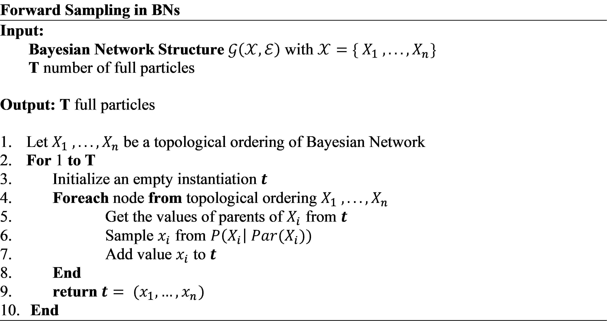

## Description

> Forward Sampling and conversion of the Bayesian Network to a JSON object

This script is supported by the [pgmpy](https://pgmpy.org/) library. The purpose is to generate datasets for Bayesian Networks using the Forward Sampling algorithm and convert Bayesian Networks to the appropriate JSON objects.

There are three options:

1. Generate dataset using Forward Sampling
2. Convert a BN to JSON object
3. Convert a BN to JSON object as string


> Forward Sampling in Bayesian Networks



```
 Time Complexity: Ο(M∙n∙p∙logd)
    O(logd): Sampling distribution
    O(p): Indexing time

```
